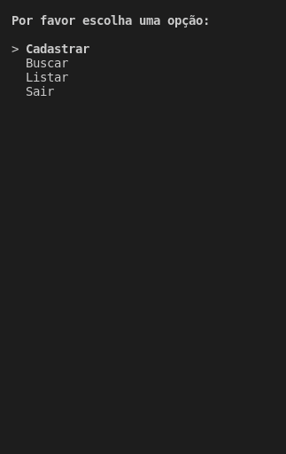

### README

<h1 align='center'> Terminal Menu de cadastro, busca e listagem de imóveis </h1>

 <b>Projeto de estudo executado com Python e SQLite </b>

### Funcionalidades

- [x] Cadastrar imóvel através das informações dadas pelo usuário
- [x] Buscar endereço atráves da busca feita pelo usuário 
- [x] Listar os endereços disponíveis no banco de dados 

### Demonstração
<h1> 
 
</h1>